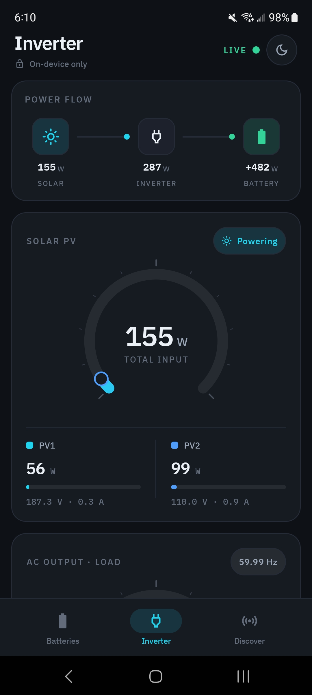
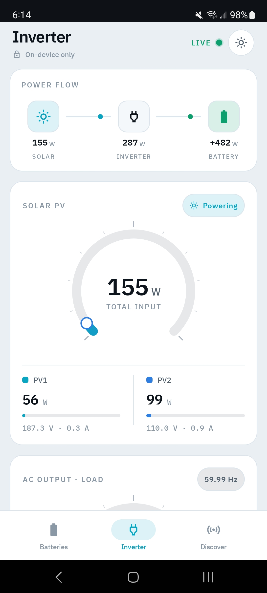
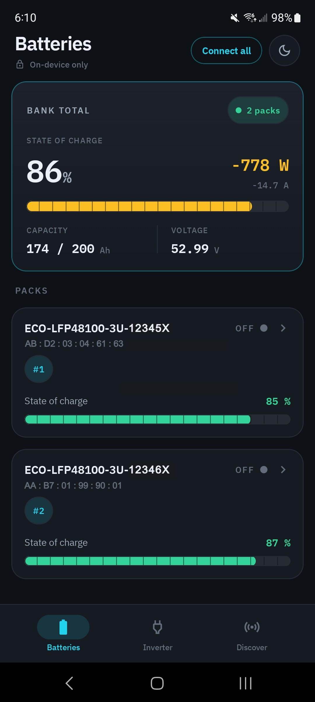
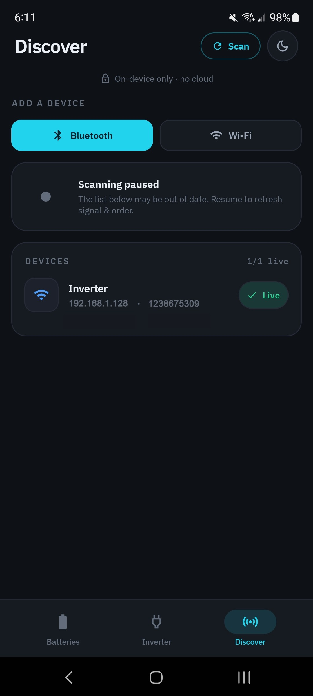

# Private Solar Monitoring

This Android app is intended to replace proprietary corporate apps for monitoring off-grid
solar setups. It does not require any login/email or privacy-violating sharing of location.
It connects via Bluetooth and optionally via wifi if your inverter supports it.

It monitors **Eco-Worthy LiFePO₄ batteries** over Bluetooth — state of charge, pack voltage,
current, **cycle index**, per-cell voltages (min/max), and temperatures (min/max) — and can
read a compatible inverter over WiFi, all without the official app.

## Download

[](https://github.com/mydataismydata/private-solar-app/releases/latest/download/PrivateSolarMonitoring.apk)

**[⬇️ Download the latest APK](https://github.com/mydataismydata/private-solar-app/releases/latest/download/PrivateSolarMonitoring.apk)** — open it on your Android phone to install.

That link always downloads the newest release directly (one tap, no extra page). Prefer to
browse versions and changelogs? See **[all releases](https://github.com/mydataismydata/private-solar-app/releases)**.

> **Installing a sideloaded app:** the first time, Android asks you to allow installs from
> your browser/file app (**Settings → Install unknown apps**). Approve it, then tap the file
> again. Because every release is signed with the same key, later versions update in place —
> no need to uninstall. Requires Android 8.0 (API 26) or newer.

## Screenshots

<table width="100%">
  <tr>
    <td width="50%" align="center"><br><b>Inverter</b> — dark</td>
    <td width="50%" align="center"><br><b>Inverter</b> — light</td>
  </tr>
  <tr>
    <td width="50%" align="center"><br><b>Batteries</b> — bank + packs</td>
    <td width="50%" align="center"><br><b>Discover</b> — Bluetooth &amp; Wi-Fi</td>
  </tr>
</table>

## What hardware this targets

The battery in this project is an **`ECO-LFP48100-3U`** (2026 Eco-Worthy 48 V / 51.2 V
100 Ah server-rack "Cubix100", 16S). It uses a **JBD UP16S015 BMS**, which speaks the
well-documented **JBD / Xiaoxiang ("Overkill Solar") BLE protocol**:

```
GATT service 0xFF00 | notify(RX) 0xFF01 | write(TX) 0xFF02
Command : DD A5 <cmd> <len> [data] <crcHi> <crcLo> 77
Response: DD <cmd> <status> <len> [data] <crcHi> <crcLo> 77
CRC = (0x10000 - sum(bytes from index 2 up to the CRC)) & 0xFFFF, big-endian
Reads   : 0x03 basic info · 0x04 cell voltages · 0x05 device name
```

> ⚠️ Other Eco-Worthy lines differ: 12 V units use a **BW02** module (a different
> `0xFFF0` / `A1`/`A2` frame format), and the oldest `ECOxxxx` units use **Classic
> Bluetooth (SPP)**, not BLE. This app implements the **JBD** path used by the 48 V rack
> battery. Confirm your device advertises with a JBD-style name / the `FF00` service first.

## Project layout

```
tools/verify_parser.py     Standalone protocol validator (run it now, no Android needed)
app/src/main/java/com/privatesolarmon/app/
  bms/    BmsSample, JbdProtocol (framing+CRC), JbdParser (reassembly+decode)   ← pure, tested
  ble/    BleUuids, BleScanner, BatteryClient (GATT engine: connect/notify/poll)
  ui/     MainActivity, Compose screens: MonitorScreen + DiscoveryScreen (sniffer)
  data/   BatteryRepository (client cache + persisted MAC list)
app/src/test/java/.../JbdParserTest.kt   JUnit tests over real captured frames
```

## Verify the decoder right now (no Android tooling required)

The protocol math is proven against real hardware frames before any device is involved:

```bash
python tools/verify_parser.py
# -> ALL ASSERTIONS PASSED - OK
```

The Kotlin `JbdParser` mirrors that exact logic; `JbdParserTest` re-checks it against the
same frames (and stresses multi-packet reassembly + CRC rejection).

## Build & run the app

You have JDK 21 but no Android SDK yet. To build/run on a phone:

1. Install **Android Studio** (Koala/Ladybug or newer).
2. **Open** this folder. Studio will download Gradle (per
   `gradle/wrapper/gradle-wrapper.properties`) and the Android SDK, and create the Gradle
   wrapper on first sync. *(If you prefer the CLI and have Gradle installed, run
   `gradle wrapper` once, then `./gradlew :app:testDebugUnitTest` to run the parser tests,
   and `./gradlew :app:assembleDebug` to build the APK.)*
3. Plug in an Android phone (USB debugging on) and Run.

Min SDK 26, target/compile SDK 34.

## Using the app

- **Discover** tab → **Start scan** → find your battery (look for the `ECO-LFP…` name).
  - **Add** registers it for live monitoring.
  - **Sniff** opens the raw panel: send `0x03` / `0x04` / `0x05` or arbitrary hex and watch
    every BLE frame (TX/RX) in a live hex log. This is your reverse-engineering tool.
- **Monitor** tab → cards show live SOC, voltage, current, power, cycle index, cell
  min/max (+Δ), temp min/max, MOSFET state, and protection status. You can also **Add** a
  battery by typing the MAC straight from the official app. Each battery in a parallel bank
  is a separate BLE device (its own MAC); add each one.
- **Inverter** tab → enter the **dongle IP** and the **logger serial** to read a
  Solarman-connected SRNE inverter (PV / battery / load / grid) over WiFi. See
  **Connecting over WiFi** below to get the dongle onto your network first.

## Connecting over WiFi (inverter dongle)

If your inverter has a Solarman-style WiFi data logger ("stick"/dongle), the app can read it
directly over your local network (TCP port 8899) — no cloud account required. You first have
to get the dongle onto your home WiFi:

1. **Find the dongle's serial.** It's printed on the sticker on the stick (the digits you'll
   also type into the app's **Logger serial** field), and is often reused as the name of the
   WiFi network the dongle broadcasts.
2. **Join the dongle's own WiFi.** Out of the box the dongle broadcasts its own private access
   point, named something like `AP_<serial>`. On your phone or laptop, connect to it (it's
   open, or the password is on the sticker).
3. **Open the dongle's config page.** In a browser, go to **`http://10.10.100.254`** and log
   in with the default credentials **`admin` / `admin`**.
4. **Add your home network.** Use the wizard / STA ("station") mode setup, scan for networks,
   and select your **2.4 GHz** WiFi — these dongles do **not** support 5 GHz. Enter your WiFi
   password and save. The dongle restarts and joins your network.
5. **Find the dongle's new IP.** Once it's on your network, your router assigns it an address
   (check the router's DHCP client list, or scan the subnet). Reserve a static IP for it so it
   doesn't change.
6. **Enter it in the app.** On the **Inverter** tab, put that address in **Dongle IP** and the
   serial in **Logger serial** (port 8899 is used automatically), then connect. Your phone must
   be on the same network as the dongle.

> Exact AP name, setup-page IP, and default password vary by dongle model/firmware — check the
> sticker and the quick-start sheet if the defaults above don't match. Change the default
> `admin/admin` password after setup.

## Known gaps (need on-hardware sniffing)

- **Inverter register map**: inverter reads go over WiFi (Solarman V5 framing + SRNE Modbus),
  not the JBD `0x03`/`0x04` BLE telemetry. The register map targets SRNE-family inverters and
  may need tuning for other models — capture the exchange (Android HCI snoop log + Wireshark,
  or the `tools/` probes) and compare against the official app if a field looks off.
- **Per-unit quirks**: this exact 2026 SKU hasn't been confirmed byte-for-byte against the
  official app yet. If a field looks off, capture the frame in the Sniff panel and compare.

Tips: the BMS usually allows **one BLE connection at a time** — close the official Eco-Worthy
app while testing. Newer firmware may require a password before reads; `BatteryClient.connect()`
accepts one (`JbdProtocol.authCommand`, default `000000`).

## Credits

Protocol details and the captured test frames are derived from
[patman15/aiobmsble](https://github.com/patman15/aiobmsble) (**Apache-2.0**) and its
companion Home Assistant integration
[patman15/BMS_BLE-HA](https://github.com/patman15/BMS_BLE-HA).
